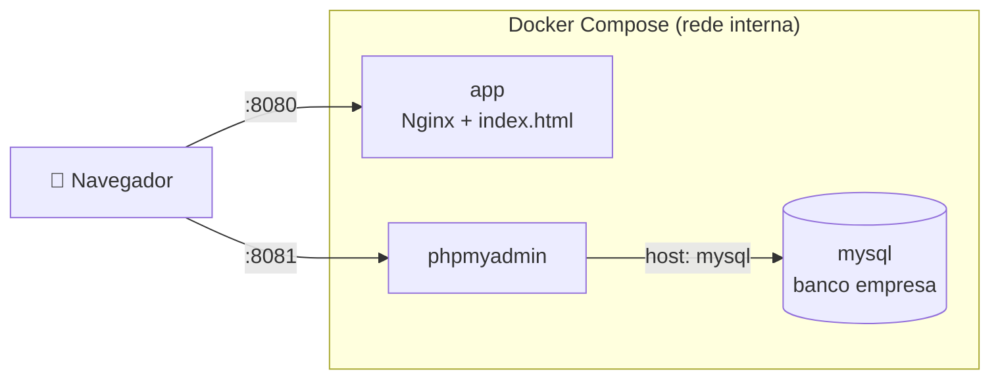
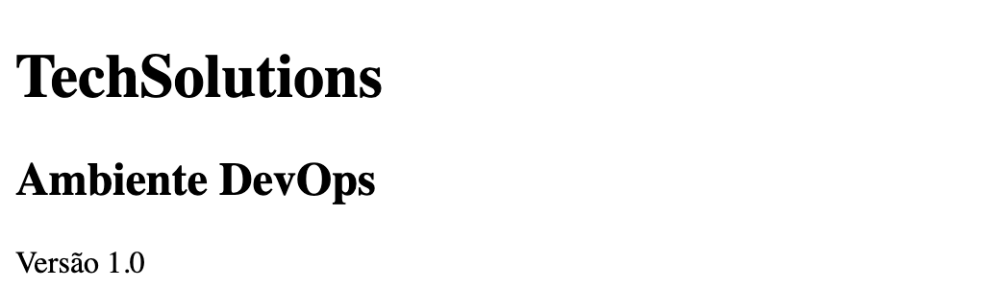
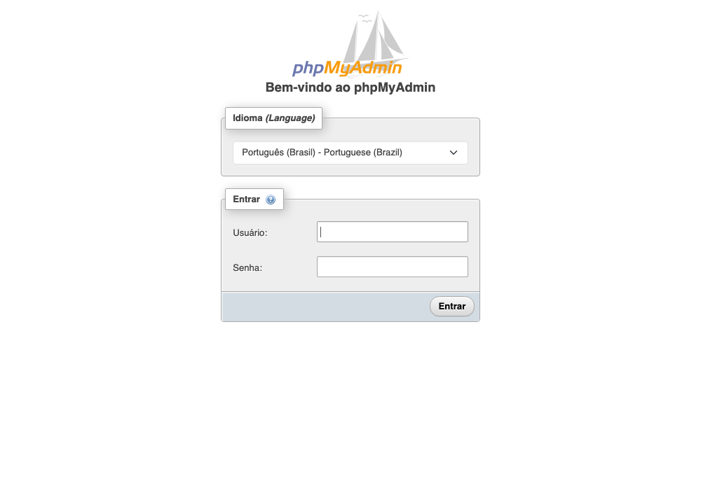

<div align="center">

# 🐳 TechSolutions — Ambiente DevOps Reproduzível

**Aplicação web + MySQL + phpMyAdmin em containers, orquestrados com Docker Compose e versionados com Git.**


</div>

> **Avaliação Prática – Unidade I** · Configuração e Manutenção de Infraestrutura de Software (DevOps) · Prof. Adilson da Silva
> **Integrante:** Wictor Melo

---

## 🚀 Início rápido

Você só precisa de **Git**, **Docker** e **Docker Compose v2**, com as portas **8080** e **8081** livres.

```bash
git clone https://github.com/Wictor0/avaliacao-devops.git
cd avaliacao-devops
docker compose up -d --build
```

Aguarde cerca de 30 a 60 segundos na primeira execução (o MySQL inicializa o banco) e acesse:

| O quê | Endereço | Credenciais |
|---|---|---|
| 🌐 Aplicação | <http://localhost:8080> | — |
| 🗄️ phpMyAdmin | <http://localhost:8081> | usuário `aluno` · senha `aluno123` |

> [!NOTE]
> Se estiver numa VM, troque `localhost` pelo IP da VM (veja com `hostname -I`).

---

## 🎯 Objetivo

A TechSolutions montava o ambiente da equipe manualmente, o que dificultava reproduzi-lo em outras máquinas. Este projeto padroniza tudo em **código**: o `Dockerfile` gera a imagem da aplicação e o `compose.yaml` descreve os três serviços. Qualquer pessoa recria o ambiente inteiro com um único comando, sem instalar nada além do Docker.

## 🏗️ Arquitetura



Os três serviços ficam na **mesma rede criada pelo Compose**. Por isso o phpMyAdmin encontra o MySQL pelo **nome do serviço** (`mysql`), sem precisar de IP.

## 🧩 Serviços e portas

| Serviço | Origem | Porta no host | Observações |
|---|---|---|---|
| `app` | `build: .` (Dockerfile, base `nginx:alpine`) | **8080** → 80 | página TechSolutions v1.0 |
| `mysql` | `image: mysql:8` | *(não publicada)* | banco `empresa`, usuário `aluno`, volume `db_data`, *healthcheck* |
| `phpmyadmin` | `image: phpmyadmin:latest` | **8081** → 80 | `PMA_HOST=mysql`; só inicia quando o MySQL está saudável |

O `app` usa **`build`** porque é código nosso; `mysql` e `phpmyadmin` usam **`image`** porque já existem prontos no Docker Hub.

## 🖼️ Como fica

<p align="center">
  
  &nbsp;
  
</p>

## 🔑 Credenciais (laboratório)

| Item | Valor |
|---|---|
| Banco | `empresa` |
| Usuário | `aluno` / senha `aluno123` |
| Root do MySQL | `root123` |

> [!WARNING]
> São credenciais **somente de estudo local**. Para trocá-las, copie `.env.example` para `.env` (arquivo ignorado pelo Git) e edite os valores antes de subir o ambiente.

## 🕹️ Como usar

```bash
docker compose up -d --build     # iniciar: constrói a imagem e sobe os 3 serviços
docker compose ps                # verificar os containers
docker compose logs -f mysql     # acompanhar os logs de um serviço
docker compose down              # encerrar e remover os containers (mantém os dados do banco)
docker compose down -v           # encerrar removendo também o volume do banco
```

### Verificações úteis

```bash
curl -I http://localhost:8080                                   # aplicação responde 200
curl -I http://localhost:8081                                   # phpMyAdmin responde 200
docker compose exec phpmyadmin getent hosts mysql               # o nome do serviço é resolvido
docker compose exec mysql mysql -ualuno -paluno123 -e 'SHOW DATABASES;'
```

## ♻️ Teste de reprodutibilidade

```bash
docker compose down -v            # interrompe e remove containers, rede e volume
docker rmi techsolutions-app:1.0  # remove a imagem construída
docker compose ps                 # nenhum serviço em execução
docker compose up -d --build      # reconstrói tudo a partir do Dockerfile e do compose.yaml
```

✅ Executado em **06/10/2026** na VM Ubuntu 24.04: depois de derrubar tudo, a reconstrução recriou a imagem e os três serviços, com a aplicação em `:8080`, o phpMyAdmin em `:8081` e o banco `empresa` acessível pelo usuário `aluno`, **sem nenhuma configuração manual anterior**.

## 📁 Estrutura do projeto

```text
avaliacao-devops/
├── app/
│   └── index.html        # página da aplicação
├── docs/img/             # capturas de tela usadas neste README
├── Dockerfile            # receita da imagem (nginx:alpine + index.html)
├── .dockerignore         # o que não entra no contexto do build
├── compose.yaml          # serviços app, mysql e phpmyadmin
├── .env.example          # modelo de variáveis (copie para .env)
├── .gitignore            # ignora .env, logs e arquivos de editor/SO
└── README.md
```

## 🛠️ Solução de problemas

| Sintoma | Causa provável | O que fazer |
|---|---|---|
| `port is already allocated` (8080/8081) | outra aplicação usa a porta | `ss -ltnp \| grep -E '8080\|8081'` e pare quem estiver usando |
| phpMyAdmin demora a subir | o MySQL ainda está inicializando | aguarde e veja `docker compose ps` (deve ficar `healthy`) |
| Login recusado no phpMyAdmin | senha diferente da padrão (`.env` alterado) | use os valores do seu `.env` |
| Quero recomeçar do zero | — | `docker compose down -v` e depois `docker compose up -d --build` |

## 🩺 Diagnóstico do Ubuntu (Etapa 1)

Comandos executados na VM antes de iniciar a configuração:

```text
$ whoami
ubuntu
$ hostname
gerenciamento-processos
$ hostname -I | cut -d' ' -f1
192.168.252.3
$ grep PRETTY_NAME /etc/os-release
PRETTY_NAME="Ubuntu 24.04.4 LTS"
$ git --version
git version 2.43.0
$ docker --version
Docker version 29.1.3, build 29.1.3-0ubuntu3~24.04.2
$ docker compose version
Docker Compose version 2.40.3+ds1-0ubuntu1~24.04.1
```

## 🌿 Histórico Git

Repositório versionado na branch `main`, com commits pequenos e coerentes (aplicação → Dockerfile → Compose → documentação). Consulte com:

```bash
git log --oneline
```
